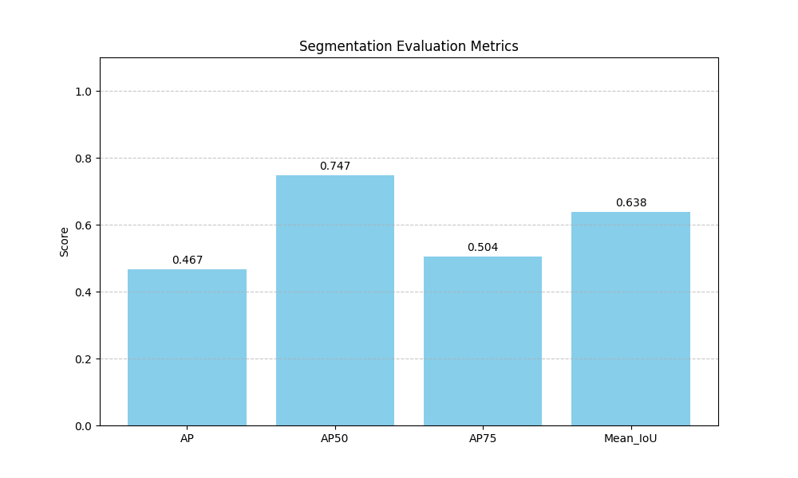

# Human Segmentation Framework

A comprehensive framework for human segmentation in images and videos using Mask2Former models.


## Overview

This project provides tools for detecting and segmenting humans in different media types:
- Single images
- Video files
- Live webcam feed

The system uses Hugging Face's implementation of Mask2Former with a COCO-trained model to identify people and create pixel-perfect segmentation masks. Performance evaluation against standard datasets like COCO is also supported.

## Features

- **Image Segmentation**: Process individual images to detect and segment humans
- **Video Processing**: Apply segmentation to video files with visualization
- **Webcam Integration**: Real-time human segmentation with various display modes
- **Evaluation Framework**: Compare segmentation quality against COCO ground truth
- **Multi-instance Support**: Detect and segment multiple individuals with unique coloring

## Requirements

The project depends on several libraries for deep learning, computer vision, and evaluation. Main dependencies include:

- Python 3.9+
- PyTorch 2.5.1+
- Transformers 4.51.1+
- OpenCV 4.11.0+
- Matplotlib
- PyCocoTools
- PIL (Pillow)
- NumPy
- tqdm

A complete list of dependencies can be found in `requirements.txt`.

## Installation

1. Clone this repository:
   ```bash
   git clone https://github.com/yourusername/human-segmentation-framework.git
   cd human-segmentation-framework
   ```

2. Create and activate a virtual environment (recommended):
   ```bash
   python -m venv venv
   # On Windows
   venv\Scripts\activate
   # On macOS/Linux
   source venv/bin/activate
   ```

3. Install dependencies:
   ```bash
   pip install -r requirements.txt
   ```

## Usage

### Image Segmentation

To segment humans in a single image:

```bash
python image_segmentation_windows.py --image path/to/image.jpg --output result.jpg
```

Parameters:
- `--image`: Path to the input image (required)
- `--output`: Path to save the output visualization (optional)
- `--no-display`: Disable display of results (optional)

### Video Segmentation

To process a video file:

```bash
python video_segmentation_windows.py --video path/to/video.mp4 --output processed.mp4
```

Parameters:
- `--video`: Path to input video file (required)
- `--output`: Path to save processed video (optional)
- `--no-display`: Disable display during processing (optional)

### Webcam Segmentation

For real-time webcam processing:

```bash
python webcam_segmentation_windows.py --camera 0 --mode split --downsample 0.5 --output recording.mp4
```

Parameters:
- `--camera`: Camera device ID (default: 0)
- `--mode`: Display mode (choices: "split", "original", "mask", "segmented", "overlay", "black_bg", default: "overlay")
- `--downsample`: Factor to downsample frames for faster processing (default: 0.5)
- `--output`: Path to save output video (optional)

Controls during webcam mode:
- Press 'q' to quit
- Press 'm' to cycle through display modes

### Evaluation

To evaluate segmentation quality against COCO annotations:

```bash
python coco_evaluation.py --annotations dataset/annotations.json --images dataset/images --num-images 100
```

Parameters:
- `--annotations`: Path to COCO annotation JSON file (required)
- `--images`: Directory containing the images (required)
- `--num-images`: Number of images to evaluate (optional, default: all)
- `--output`: Path to save results plot (optional, default: "evaluation_results.png")

## Implementation Details

### Image Segmentation (`image_segmentation_windows.py`)

The `HumanSegmenter` class provides the core functionality for detecting and segmenting humans in images:

- Loads the Mask2Former model pre-trained on COCO panoptic segmentation
- Processes images to identify person instances (class ID 0 in COCO panoptic segmentation)
- Creates three output visualizations:
  1. Original image
  2. Binary person mask
  3. Segmented overlay with unique colors per person

### Video Processing (`video_segmentation_windows.py`)

The `VideoHumanSegmenter` extends the image segmentation to video files:

- Processes video frames sequentially
- Maintains instance tracking across frames
- Displays original and segmented views side-by-side
- Shows processing time and frame information

### Webcam Integration (`webcam_segmentation_windows.py`)

The `WebcamHumanSegmenter` provides real-time segmentation:

- Supports multiple display modes for different visualization styles
- Optional downsampling for improved performance
- Real-time FPS and processing time statistics
- Video recording capability

### Evaluation Framework (`coco_evaluation.py`)

The `SegmentationEvaluator` implements metrics for comparing segmentation quality:

- Computes AP (Average Precision) at different IoU thresholds
- Calculates mean IoU (Intersection over Union)
- Handles edge cases with fallback calculation methods
- Generates visualization of evaluation metrics

## Architecture

The system is designed with the following components:

1. **Model Initialization**: Loads Mask2Former with pre-trained weights
2. **Image Processing**: Pre-processes images to model input format
3. **Segmentation**: Applies the model to detect and segment humans
4. **Post-processing**: Converts model outputs to usable masks and visualizations
5. **Evaluation**: Compares results against ground truth annotations

## Model Information

The project uses the Mask2Former model with a Swin Transformer backbone, pre-trained on the COCO panoptic segmentation task. The model is automatically downloaded from Hugging Face on first run.

Default model: `facebook/mask2former-swin-base-coco-panoptic`

## Performance Considerations

- GPU acceleration is strongly recommended and used automatically when available
- The `downsample` parameter in webcam mode can be adjusted for performance
- Processing time varies depending on image size and the number of humans detected

## Known Limitations

- Performance may degrade with large numbers of people in frame
- Challenging lighting conditions can affect detection quality
- Overlapping individuals may sometimes be merged into a single instance
- The COCO evaluation requires valid annotations in the expected format

## Examples

### Image Segmentation Result


### Evaluation Metrics


## Evaluation Metrics Explained

The evaluation produces four key metrics:

- **AP**: Average Precision across IoU thresholds from 0.5 to 0.95 (in 0.05 increments)
- **AP50**: Average Precision at IoU threshold of 0.5
- **AP75**: Average Precision at IoU threshold of 0.75
- **Mean_IoU**: Mean Intersection over Union across all detected instances

Higher values indicate better segmentation quality, with a maximum possible value of 1.0.

## License

This project is released under the MIT License.

## Acknowledgments

- The Mask2Former model is from the Hugging Face Transformers library
- Evaluation code uses the COCO API (pycocotools)
- Inspiration from various segmentation frameworks and research papers

## Contributing

Contributions are welcome! Please feel free to submit a Pull Request.
